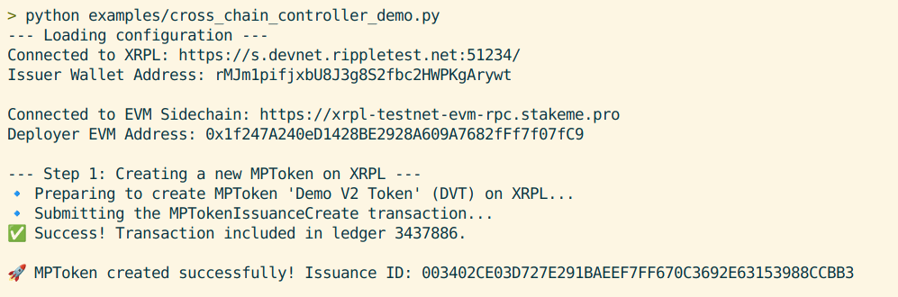
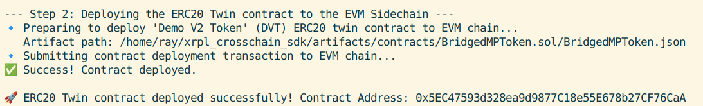
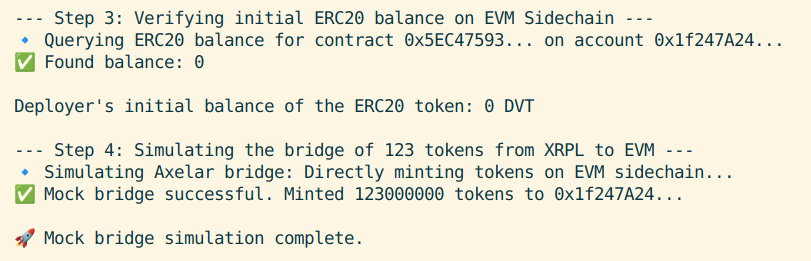
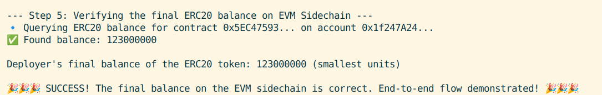
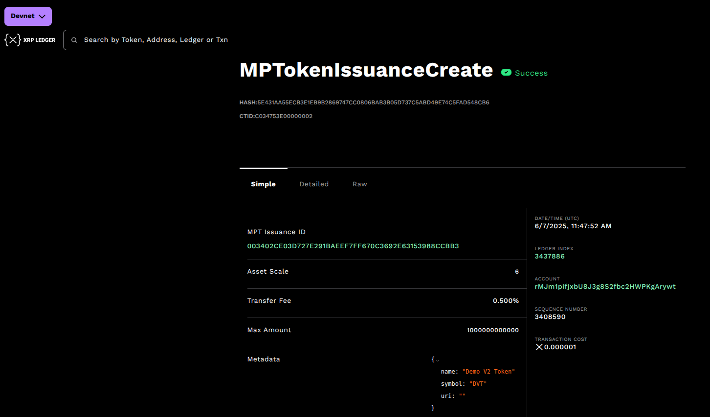
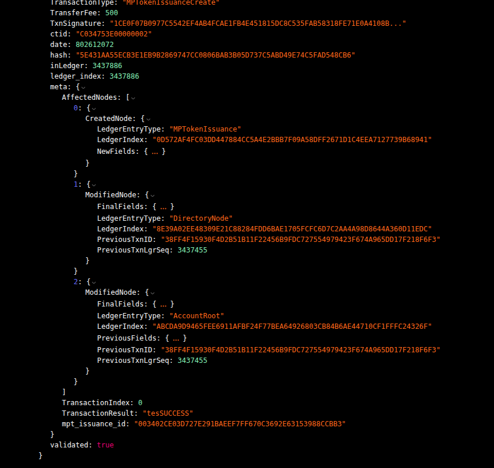
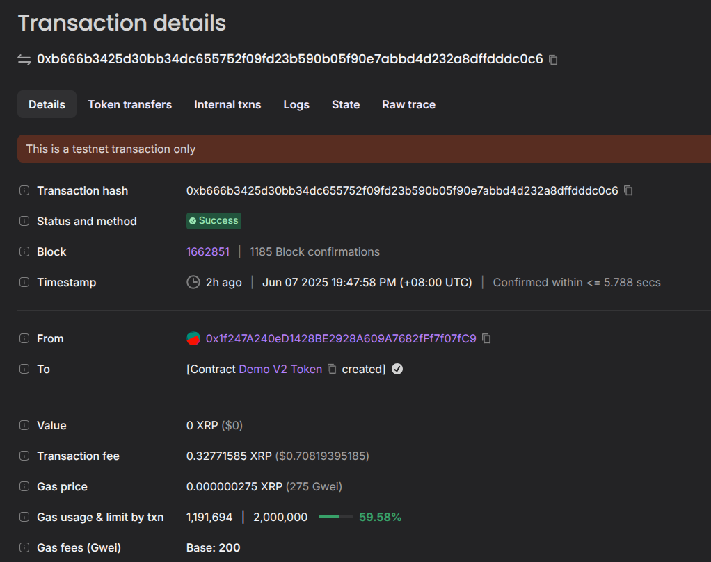
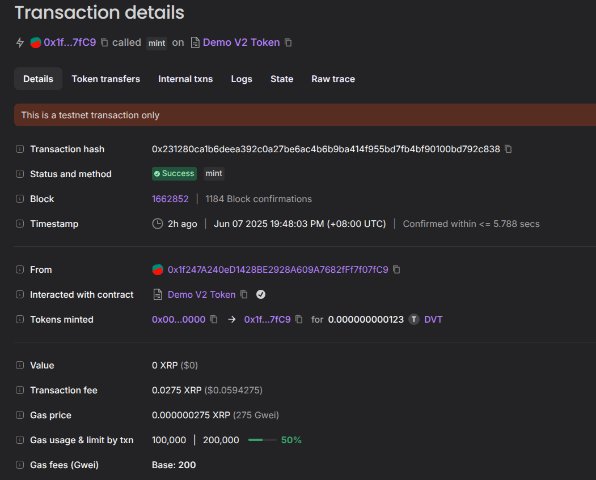

# XRPL Cross-Chain MPToken SDK

[](placeholder_for_license_link)

A Python SDK designed to demonstrate a complete architectural flow for creating and bridging experimental Multi-purpose Tokens (MPTokens) from the XRP Ledger (XRPL) to the XRPL EVM Sidechain. This project was built for the **Ripple x EasyA Hackathon 2025**.

## Short Summary

The XRP Ledger's introduction of Multi-purpose Tokens (MPTokens) opens the door for a new generation of flexible, on-ledger assets. However, the true potential of these assets is limited if they remain siloed from the broader DeFi ecosystem. This SDK provides the critical "superhighway" for these assets to achieve cross-chain interoperability. After discovering limitations in the current bridging infrastructure for this experimental token type, we engineered a robust mocked bridge to prove the concept. With a few simple Python functions, our SDK abstracts away the complexity of on-chain operations, allowing developers to create an MPToken on the XRPL, deploy its EVM twin, and simulate a successful bridge to mint tokens on the other side.

## The Problem

While the XRPL is a highly efficient network for creating new asset types like MPTokens, these assets are natively isolated. To make them useful in the broader Web3 ecosystem (e.g., in DeFi protocols), they need to be bridged. This process is currently a significant hurdle for developers, requiring:

* Deep, low-level knowledge of both the XRP Ledger and EVM environments.
* Complex transaction formatting for cross-chain messaging protocols.
* The use of multiple, distinct libraries (`xrpl.py`, `web3.py`) to handle a single logical operation.
* Navigating undocumented bugs and limitations in experimental library features, especially around bridging new token types.

This high barrier to entry slows down innovation and prevents developers from easily building applications that span the entire Ripple ecosystem.

## The Solution: A Simple, Powerful SDK

Our SDK solves this problem by providing a clean, high-level Python interface that handles the on-chain components and proves the architectural soundness of a cross-chain bridge.

### What Our SDK Can Do:

* **`create_mptoken_on_xrpl()`**: Programmatically create and configure a new MPToken on the XRPL Devnet.
* **`deploy_erc20_twin_on_evm()`**: Automatically deploy a standard, DeFi-compatible ERC20 "twin" contract to the XRPL EVM Sidechain.
* **`mock_bridge_and_mint()`**: Simulates a successful bridge transaction by directly minting the corresponding ERC20 token on the EVM sidechain. This demonstrates the full architectural flow while working around current infrastructure limitations (MPT bridging in Axelar SDK is not supported in Devnet yet).

## Demo

Our proof-of-concept script (`examples/cross_chain_controller_demo.py`) demonstrates the full, end-to-end functionality of the SDK's architecture.

1.  **Create an MPToken on XRPL.**
2.  **Deploy its ERC20 Twin on the EVM Sidechain.**
3.  **Simulate the bridge** by calling the `mint` function on the ERC20 contract.
4.  **Verify the final balance** on the EVM Sidechain has increased correctly.

### Demo Output
Here's a snapshot of the successful output from the demo script + transactions on the XRPL and EVM sidechain explorer::










## Links & Resources

* **Slide Deck:** `[https://www.canva.com/design/DAGppiQhudk/afLmJ_cGQrz2i2Phrerl-g/edit?utm_content=DAGppiQhudk&utm_campaign=designshare&utm_medium=link2&utm_source=sharebutton]`
* **Video Demo:** `[placeholder_for_your_video_demo_link]`
* **XRPL MPToken Issuance Transaction:** `[https://devnet.xrpl.org/transactions/5E431AA55ECB3E1EB9B2869747CC0806BAB3B05D737C5ABD49E74C5FAD548CB6/raw]`
* **EVM Contract Deployment:** `[https://explorer.testnet.xrplevm.org/tx/0xb666b3425d30bb34dc655752f09fd23b590b05f90e7abbd4d232a8dffdddc0c6]`
* **Simulated Bridge Mint Transaction:** `[https://explorer.testnet.xrplevm.org/tx/0x231280ca1b6deea392c0a27be6ac4b6b9ba414f955bd7fb4bf90100bd792c838]`

## How To Run

To get this project up and running, follow these steps.

### 1. Prerequisites

* Python 3.8+
* Node.js 18+ and npm
* An activated Python virtual environment (`venv`)

### 2. Setup

Clone the repository and install the required dependencies.

```bash
# Clone the repo
git clone [placeholder_for_your_repo_link]
cd xrpl-crosschain-sdk

# Install Python dependencies
pip install -r requirements.txt

# Install JavaScript dependencies (for Hardhat)
npm install
```

### 3. Configuration

Create a `.env` file in the root of the project and populate it with your test credentials. Use the official faucets to get funded accounts.

```env
# .env file

# XRPL Devnet
XRPL_TESTNET_URL="https://s.devnet.rippletest.net:51234/"
XRPL_WEBSOCKET_URL="wss://s.devnet.rippletest.net:51233/"
XRPL_ACCOUNT_ADDRESS="r..._your_funded_devnet_address"
XRPL_ACCOUNT_SECRET="s..._your_funded_devnet_secret"

# EVM Sidechain
EVM_SIDECHAIN_RPC_URL="https://xrpl-testnet-evm-rpc.stakeme.pro"
EVM_SIDECHAIN_CHAIN_ID="1440000"
EVM_SIDECHAIN_ADDRESS="your_evm_account_address_0x..."
```

### 4. Compile Smart Contracts

Compile the Solidity contract using Hardhat.

```bash
npx hardhat compile
```

### 5. Run the Demo

Execute the main demo script.

```bash
python examples/cross_chain_controller_demo.py
```